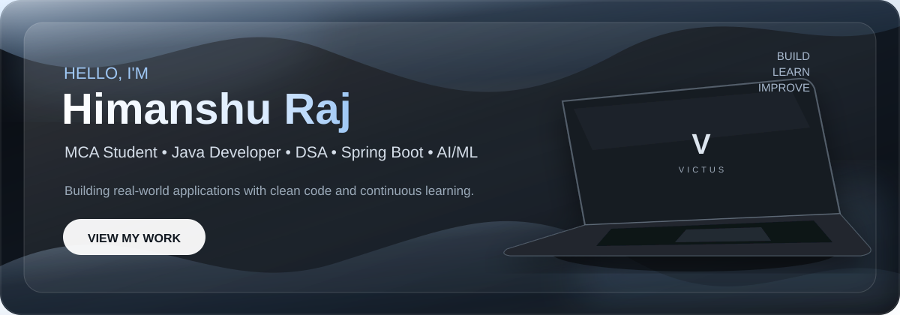

<div align="center">



<br/>

# Himanshu Raj

### Java Developer · DSA · Spring Boot · AI/ML

Building real-world applications with clean code and continuous learning.

<br/>

<a href="https://github.com/himanshu-raaj">

</a>
&nbsp;
<a href="https://www.linkedin.com/">

</a>

</div>

---

## About Me

I'm an **MCA student at Lovely Professional University** with a strong
interest in **Java development, Data Structures & Algorithms, backend
engineering and Artificial Intelligence**.

- 🎓 MCA Student at Lovely Professional University
- ☕ Focused on Java and Object-Oriented Programming
- 🧠 Practicing Data Structures & Algorithms
- ⚙️ Learning Spring Boot and backend development
- 🗄️ Working with MySQL and MongoDB
- 🤖 Exploring AI, Machine Learning and Computer Vision
- 🚀 Building real-world software projects

---

## Tech Stack

<div align="center">

### Languages


<br/><br/>

### Backend & Frameworks


<br/><br/>

### Frontend


<br/><br/>

### Database


<br/><br/>

### Tools


</div>

---

## Featured Projects

<table>
<tr>

<td width="50%" valign="top">

### 🤖 AI CCTV Accident Detection

AI-based CCTV system for detecting accidents and emergency situations.

**Tech Stack**

`Python` `Flask` `YOLO` `OpenCV` `MySQL` `Socket.IO`

**Focus**

Computer Vision · AI · Real-time Detection

</td>

<td width="50%" valign="top">

### 🧑‍💻 AI Developer Assistant

Full-stack developer assistant built using Java Spring Boot and React.

**Tech Stack**

`Java` `Spring Boot` `React` `MySQL` `JWT`

**Focus**

Backend Development · REST API · AI Integration

</td>

</tr>

<tr>

<td width="50%" valign="top">

### 🧾 BillMeUp

Java-based billing web application developed for managing billing
operations using file handling.

**Tech Stack**

`Java` `Servlet` `JSP` `Tomcat`

**Focus**

Java · File Handling · Web Development

</td>

<td width="50%" valign="top">

### 🧠 LeetCode Journey

My Data Structures & Algorithms practice repository with solutions
primarily implemented in Java.

**Topics**

`Arrays` `Strings` `Hashing` `Linked List` `Trees` `Graphs`

<a href="https://github.com/himanshu-raaj/Leet-Code-journey">
View Repository →
</a>

</td>

</tr>
</table>

---

## DSA Journey

I regularly practice Data Structures & Algorithms to improve my
problem-solving and coding skills.

```text
Arrays
Strings
Hashing
Linked List
Stack & Queue
Binary Search
Recursion
Trees
Heap
Graphs
Dynamic Programming
